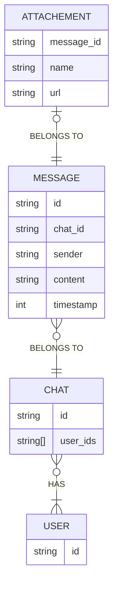
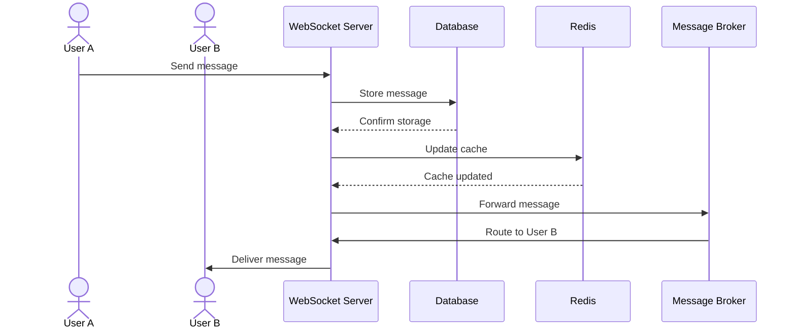
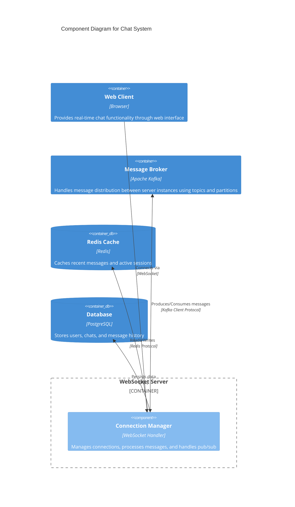

# Live chat application
## Entity relationship diagram

```mermaid
erDiagram
    CHAT }o--|{ USER : HAS
    MESSAGE }o--||CHAT : "BELONGS TO"
    ATTACHEMENT|o--||MESSAGE : "BELONGS TO"
    CHAT {
        string id
        string[] user_ids
    }
    USER{
        string id
    }
    MESSAGE{
        string id
        string chat_id
        string sender
        string content
        int timestamp
    }
    ATTACHEMENT{
        string message_id
        string name
        string url
    }
```
## Sequence diagram

```mermaid
sequenceDiagram
    actor UA as User A
    actor UB as User B
    participant WS as WebSocket Server
    participant DB as Database
    participant R as Redis
    participant MB as Message Broker

    UA->>WS: Send message
    WS->>DB: Store message
    DB-->>WS: Confirm storage
    WS->>R: Update cache
    R-->>WS: Cache updated
    WS->>MB: Forward message
    MB->>WS: Route to User B
    WS->>UB: Deliver message
```
## Component diagram

```mermaid
C4Component
    title Component Diagram for Chat System

    Container(web, "Web Client", "Browser", "Provides real-time chat functionality through web interface")
    
    Container_Boundary(ws, "WebSocket Server") {
        Component(conn, "Connection Manager", "WebSocket Handler", "Manages connections, processes messages, and handles pub/sub")
    }

    Container(broker, "Message Broker", "Apache Kafka", "Handles message distribution between server instances using topics and partitions")

    ContainerDb(redis, "Redis Cache", "Redis", "Caches recent messages and active sessions")
    ContainerDb(db, "Database", "PostgreSQL", "Stores users, chats, and message history")

    Rel(web, conn, "Connects via", "WebSocket")
    BiRel(conn, broker, "Produces/Consumes messages", "Kafka Client Protocol")
    Rel(conn, redis, "Reads/Writes", "Redis Protocol")
    Rel(conn, db, "Persists data", "SQL")

    UpdateLayoutConfig($c4ShapeInRow="3", $c4BoundaryInRow="1")
```

